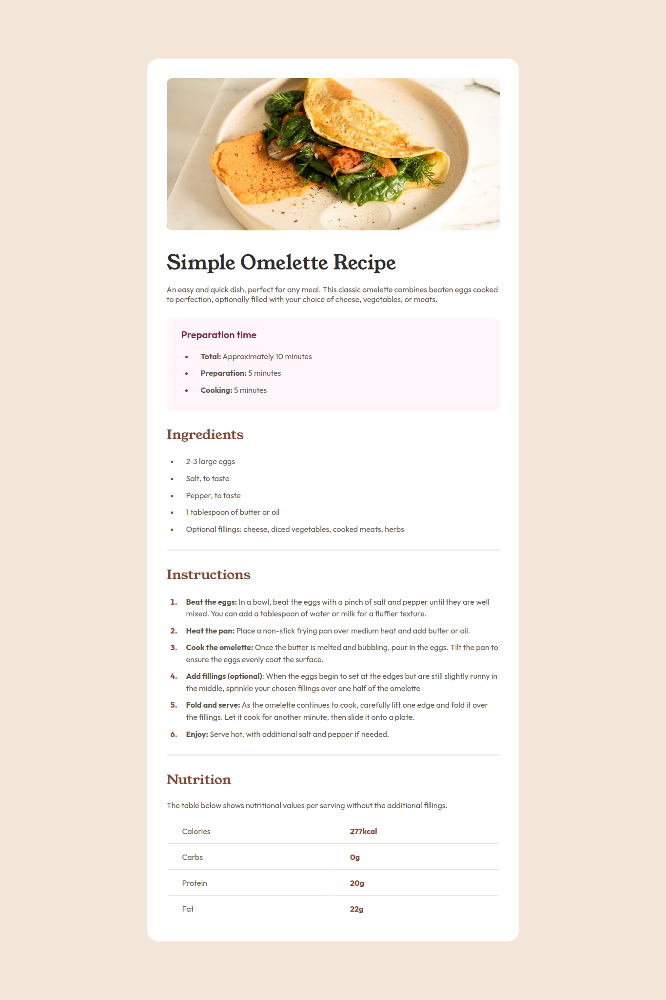

# Frontend Mentor - Recipe page solution

This is a solution to the [Recipe page challenge on Frontend Mentor](https://www.frontendmentor.io/challenges/recipe-page-KiTsR8QQKm). Frontend Mentor challenges help you improve your coding skills by building realistic projects. 

## Screenshot



## Built With

- Semantic HTML5 markup
- CSS custom properties
- Flexbox
- [ReactJS](https://reactjs.org/) - JS library

## Getting Started

### Prerequisites

- NodeJS
[Visit the official Node.js website](https://nodejs.org/en/download/)

- Vite
```sh
npm install -g vite
```

### Installation

1. Download the repository

```sh
git clone 
```

2. Install NPM packages

```sh
cd ./front-mentor-product-recipe-page-challenge
npm install 
```

3. Run the app

```sh
npm run dev
```

## Author

- Frontend Mentor - [@EltonBata](https://www.frontendmentor.io/profile/EltonBata)
- LinkedIn - [@EltonBata](www.linkedin.com/in/eltonbata)
